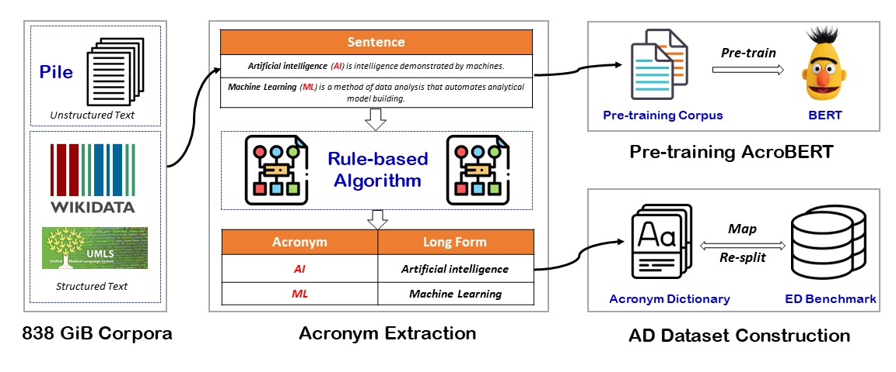

# GLADIS
GLADIS: A General and Large Acronym Disambiguation Benchmark ([Long paper at EACL 23](https://arxiv.org/pdf/2302.01860.pdf))




To accelerate the research on acronym disambiguation, we constructed a new benchmark named GLADIS and the pre-trained AcroBERT:

|  | Source  | Description |
|------|------------|------|
| [Acronym Dictionary](https://zenodo.org/record/7568937#.Y9JiQXaZNPY) | [Pile](https://github.com/EleutherAI/the-pile) (MIT license), [Wikidata](https://www.wikidata.org/wiki/Help:Aliases), [UMLS](https://www.nlm.nih.gov/research/umls/index.html) |1.6 million acronyms and 6.4 million long forms|
| [Three Datasets](https://zenodo.org/record/7568937#.Y9JiQXaZNPY) | [WikilinksNED Unseen](https://github.com/yasumasaonoe/ET4EL), [SciAD](https://github.com/amirveyseh/AAAI-21-SDU-shared-task-2-AD)(CC BY-NC-SA 4.0), [Medmentions](https://github.com/chanzuckerberg/MedMentions)(CC0 1.0)|three AD datasets that cover general, scientific, biomedical domains |
| [A Pre-training Corpus](https://zenodo.org/record/7568937#.Y9JiQXaZNPY) | [Pile](https://github.com/EleutherAI/the-pile) (MIT license) | 160 million sentences with acronyms|
| [AcroBERT](https://zenodo.org/record/7568937#.Y9JiQXaZNPY) | BERT-based model |the first pre-trained language model for general acronym disambiguation|

## Usage
AcroBERT can do end-to-end acronym linking. Given a sentence, our framework first recognize acronyms by using [MadDog](https://github.com/amirveyseh/MadDog) (CC BY-NC-SA 4.0), and then disambiguate them by using AcroBERT:

```python
from inference.acrobert important acronym_linker

# input sentence with acronyms, the maximum length is 400 sub-tokens
sentence = "This new genome assembly and the annotation are tagged as a RefSeq genome by NCBI."

# mode = ['acrobert', 'pop']
# AcroBERT has a better performance while the pop method is faster but with a low accuracy.
results = acronym_linker(sentence, mode='acrobert')
print(results)

## expected output: [('NCBI', 'National Center for Biotechnology Information')]
```

## Prepare
The new benchmark constructed in this paper is located in `input/dataset`.
The acronym dictionary is supposed to stored in this file: `input/dataset/acronym_kb.json`, which includes 1.5M acronyms
and 6.4M long forms.
However, due to the size limit of the upload files, you have to download the dictionary (with the AcroBERT model together) from this link:
[dictionary and model](https://zenodo.org/record/7568937#.Y9JiQXaZNPY). 
After downloading, decompress it and put the two files to this path `input/`


## Re-production
### Training
First you can use `-help` to show the arguments
```
python train.py -help
```
Once completing the data preparation and environment setup, we can train the model via `acrobert.py`.

```
python acrobert.py -pre_train_path ../input/pre_train_sample.txt
```
The entire pre-training needs two weeks on a single NVIDIA Tesla V100S PCIe 32 GB Specs.

### Quick Reproduction
We provide a one-line command to reproduce the scores in Table A1,
which is the easiest one to reproduce, and you can see the scores after only several minutes. 
The needed test sets are in this path `/evaluation/test_set`, and you can find three evaluation sets.
The corresponding dictionaries are in this path `/evaluation/dict`.
We also provided the AcroBERT model file in this path `/input/acrobert.pt`.
Then the scores can be obtained by using the following command:
```
python acrobert.py -mode evaluation
```
Finally, you can see the results
```
F1: [88.8, 58.0, 67.5], ACC: [93.7, 72.0, 65.3]
```

## Citation
```
Chen, Lihu, Gaël Varoquaux, and Fabian M. Suchanek. 
"GLADIS: A General and Large Acronym Disambiguation Benchmark."
arXiv preprint arXiv:2302.01860 (2023).
```
